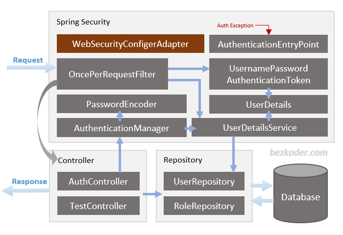
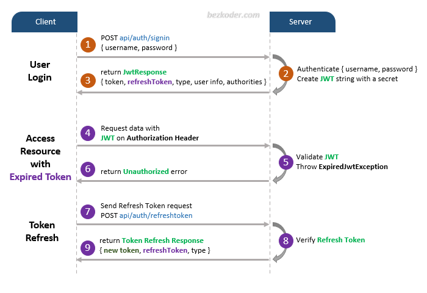
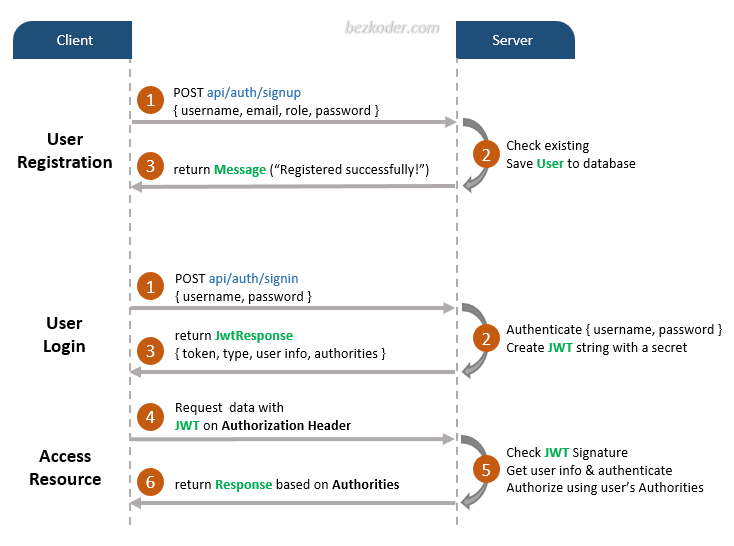

# inventory-management

## Generate a Secure Key for Signing JWTs

To generate a secure 256-bit (32-byte) key for signing your JWTs, you can use the following command on Linux:

```bash
openssl rand -base64 32
```

This command generates a random base64-encoded key. Make sure to store this key in a secure location, such as an environment variable or a secure configuration file.

## Additional Resources

For more details on implementing JWT authentication with Spring Boot and Spring Security, you can refer to this comprehensive guide: [Spring Boot JWT Authentication Example](https://github.com/bezkoder/spring-boot-spring-security-jwt-authentication).

This guide covers:

- Configuring Spring Security for JWT.

- Generating and validating JWT tokens.

- Managing roles and permissions.

- Best practices for securing your application.

## Architecture Diagrams

Below are some helpful diagrams to understand the JWT authentication flow:

1. **Spring Security Architecture**


   

2. **Example Flow**


   

3. **Authentication Flow**


   
