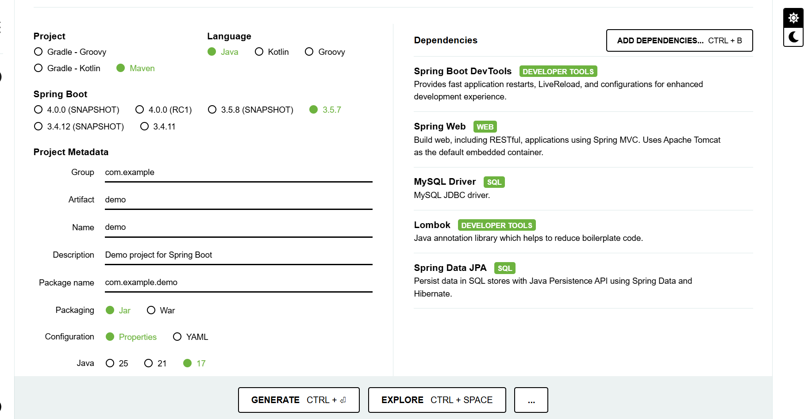
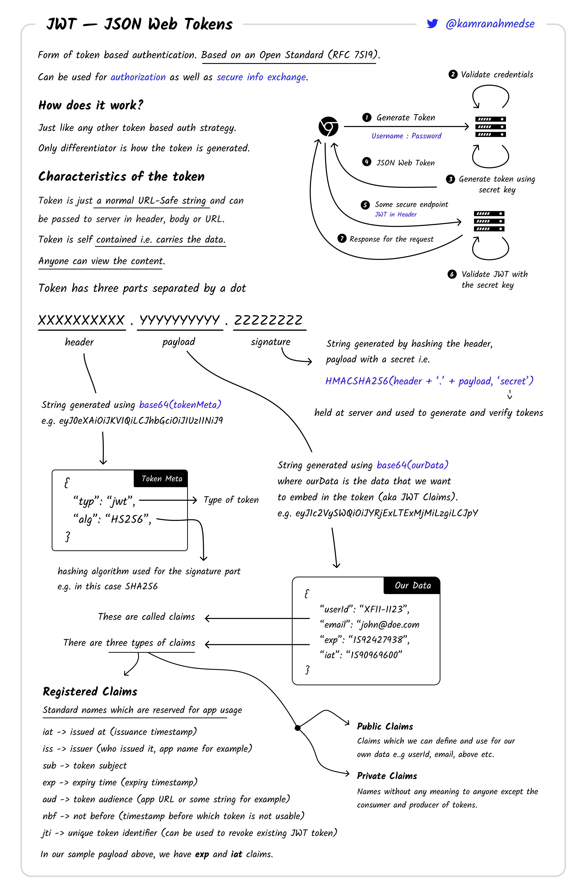

# inventory-management

## Spring Initializr — creating a starter project



Follow these steps on https://start.spring.io to generate a new Spring Boot project that matches your environment:

- Change the Group: replace the default group (for example `com.example`) with your own group id (for example `com.yourname` or `io.yourname`). This determines the base package for the generated sources.
- Modify the Artifact: set the Artifact field to the artifact id you want. When you change the Artifact, the `Name` and `Package Name` fields in the form are updated automatically — so you don't need to edit them separately.
- Choose Java version: at the bottom of the form select the Java version that matches your machine (for example 17 or 21). Pick the version installed on your system to avoid compatibility problems.
- (Optional) Select packaging (Jar/War), language (Java/Kotlin/Groovy) and add dependencies (e.g., Spring Web, Spring Security, Spring Data JPA) before generating the project.

After you download the ZIP, extract it and import the project into your IDE (Import as Maven/Gradle project).


## Generate a Secure Key for Signing JWTs

To generate a secure 256-bit (32-byte) key for signing your JWTs, you can use the following command on Linux:

```bash
openssl rand -base64 32
```

This command generates a random base64-encoded key. Make sure to store this key in a secure location, such as an environment variable or a secure configuration file.

## What is a JWT?

A JSON Web Token (JWT) is a compact, URL-safe means of representing claims to be transferred between two parties. It is commonly used for securely transmitting information between a client and a server as a JSON object. JWTs are signed using a cryptographic algorithm to ensure the integrity and authenticity of the token.

For a detailed explanation of JWTs, you can watch this video: [What is a JWT?](https://youtu.be/fskpKoT3eBc?si=UjUe7Rl6aFDqg0TB)

## Additional Resources

For more details on implementing JWT authentication with Spring Boot and Spring Security, you can refer to this comprehensive guide: [Spring Boot JWT Authentication Example](https://github.com/bezkoder/spring-boot-spring-security-jwt-authentication).

This guide covers:

- Configuring Spring Security for JWT.

- Generating and validating JWT tokens.

- Managing roles and permissions.

- Best practices for securing your application.

## Architecture Diagrams

Below are some helpful diagrams to understand the JWT authentication flow:

1. **Spring Security Architecture**


   

2. **Example Flow**


   

3. **Authentication Flow**


   

## JWT Roadmap

For a detailed roadmap on JWT authentication, you can refer to this guide: [JWT Authentication Roadmap](https://roadmap.sh/guides/jwt-authentication).

This roadmap provides a step-by-step approach to understanding and implementing JWT authentication, including best practices and common pitfalls.

Below is a visual representation of the JWT roadmap:


